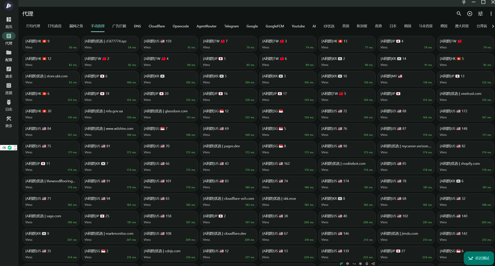

## 🏪 利群公益订阅

欢迎来到 **利群便利店**。本项目致力于通过 Cloudflare 边缘计算技术，提供稳定、高速且永久免费的代理订阅服务。  

[🌐 中文](README.md) | [🇮🇷 فارسی](README.fa.md) | [🇷🇺 Русский](README.ru.md)

  

  

> [!IMPORTANT]
>Cloudflare（以下简称 CF）免费搭建科学上网项目盘点，请为这些优秀的开源项目点上您的 **Star** ⭐️⭐️⭐️！  

### 1. 作者：Cmliu
* **代表作：** `edgetunnel`
* **项目地址：** [https://github.com/cmliu/edgetunnel](https://github.com/cmliu/edgetunnel)
* **现 Star 数：** 
* **作者博客：** [https://blog.cmliussss.com/](https://blog.cmliussss.com/)
* **YouTube 主页：** [CMLiussss](https://www.youtube.com/@CMLiussss)

### 2. 作者：Joey
* **代表作：** `cfnew`
* **项目地址：** [https://github.com/byJoey/cfnew](https://github.com/byJoey/cfnew)
* **现 Star 数：** 
* **作者博客：** [https://joeyblog.net/](https://joeyblog.net/)
* **YouTube 主页：** [joeyblog](https://www.youtube.com/@joeyblog)

### 3. 作者：佬王
* **代表作：** `Cloudflare-proxy`
* **项目地址：** [https://github.com/eooce/Cloudflare-proxy](https://github.com/eooce/Cloudflare-proxy)
* **现 Star 数：** 
* **作者博客：** 无
* **YouTube 主页：** [eooce](https://www.youtube.com/@eooce)

### 4. 作者：ygkkk
* **代表作：** `Cloudflare-vless-trojan`
* **项目地址：** [https://github.com/yonggekkk/Cloudflare-vless-trojan](https://github.com/yonggekkk/Cloudflare-vless-trojan)
* **现 Star 数：** 
* **作者博客：** [https://ygkkk.blogspot.com/](https://ygkkk.blogspot.com/)
* **YouTube 主页：** [ygkkk](https://www.youtube.com/@ygkkk)

-----

## 🚀 本项目亮点

  -  **主流支持：** 自适应 Mihomo、xray、Sing-box 内核为代表的主流代理客户端。
  -  **Cloudflare赋能：** 基于 Cloudflare 高性能开源方案搭建，兼顾速度与稳定性。[同时提供优选域名与优选IP双方案](https://github.com/LancelotRar/best-cf-ips)。
  -  **本项目当前使用 Cmliu edgetunnel 搭建**

-----

## 👊 节点及分组

  

## 📥 订阅地址    

* **订阅地址获取方式：**  关注上方利群便利店『频道』，注意**置顶信息**。
* [**自用Mihomo配置文件模板**](/src/liqun_example.yaml)，不断优化最佳实践，可fork后自行修改，亦可直接使用。
* 因CF节点具有**时效性**，本公益推荐使用**Mihomo客户端**。可以做到**定时拉取订阅，自动测延迟，自动选择延迟最低节点**，实现懒人一键代理。个人推荐轻量好用的 [**Bettbox**](https://github.com/appshubcc/Bettbox)。如果你曾经是Flclash用户，你会很快熟悉并上手。[**Bettbox交流群**](https://t.me/appshub_chat)。
---

## 📋 代理客户端推荐  

> <b>点击客户端名称可跳转至项目发布页下载</b>

| 平台 | 推荐客户端 |
| :--- | :--- |
| **Windows** | [v2rayN](https://github.com/2dust/v2rayN/releases)、[Hiddify](https://github.com/hiddify/hiddify-app/releases)、[FlClash](https://github.com/chen08209/FlClash/releases)、[mihomo-party](https://github.com/mihomo-party-org/clash-party/releases)、[Clash Verge Rev](https://github.com/clash-verge-rev/clash-verge-rev/releases)、[Clashmi](https://github.com/KaringX/clashmi/releases)、[FlyClash](https://github.com/GtxFury/FlyClash/releases)、[Karing](https://github.com/KaringX/karing/releases)、[Bettbox](https://github.com/appshubcc/Bettbox/releases) |
| **Android** | [v2rayNG](https://github.com/2dust/v2rayNG/releases)、[ClashMetaForAndroid](https://github.com/MetaCubeX/ClashMetaForAndroid/releases/)、[FlClash](https://github.com/chen08209/FlClash/releases)、[Clashmi](https://github.com/KaringX/clashmi/releases)、[Hiddify](https://github.com/hiddify/hiddify-app/releases)、[NekoBox](https://github.com/MatsuriDayo/NekoBoxForAndroid/releases)、[FlyClash](https://github.com/GtxFury/FlyClash/releases)、[Karing](https://github.com/KaringX/karing/releases)、[Bettbox](https://github.com/appshubcc/Bettbox/releases) |
| **iOS** | Surge、Shadowrocket、Stash、[Hiddify](https://github.com/hiddify/hiddify-app/releases)、Loon、Egern、[Clashmi](https://clashmi.app/download)、[Karing](https://karing.app/)、Quantumult X |
| **macOS** | [FlClash](https://github.com/chen08209/FlClash/releases)、[mihomo-party](https://github.com/mihomo-party-org/clash-party/releases)、[Clash Verge Rev](https://github.com/clash-verge-rev/clash-verge-rev/releases)、Surge、[Clashmi](https://clashmi.app/download)、[Karing](https://karing.app/)、[FlyClash](https://github.com/GtxFury/FlyClash/releases) |
| **鸿蒙** | [ClashBox](https://github.com/xiaobaigroup/ClashBox/releases) |

> [!TIP]
> 在客户端内设置 **“订阅自动更新频率 (Update Interval)”** 为 3 小时为最佳，以减少CF Workers请求数，以免刷爆导致订阅不可用。

------

## ⚖️ 免责声明  

1. **信息来源声明**：本项目所提供之订阅资源均采集自互联网公开渠道，仅供网络技术研究、学术交流及开发人员学习参考之用。
2. **合法使用义务**：使用者应严格遵守所在地相关法律法规。禁止将本项目任何资源用于违反国家法律、法规及政策的任何用途。使用者须自行承担因不当使用所引致的一切法律责任。
3. **服务性质声明**：本项目系以公益目的提供，不对服务的连续性、稳定性、可用性及准确性作出任何明示或暗示的保证。本项目不对因使用或无法使用本服务所导致的任何直接或间接损失承担责任。

## 项目热度

<picture>
  <source media="(prefers-color-scheme: dark)" srcset="https://raw.githubusercontent.com/LancelotRar/free-subs/refs/heads/main/src/star-history-dark.svg">
  
</picture>
